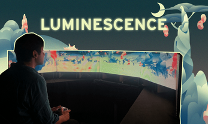

# Luminescence

Explore another quiet, exotic planet with a different perspective !

This game was made in 3 and a half day during the Alternative Output Workshop at ENJMIN 2023. The objective was to game where the output wouldn't be a regular computer screen.

The game was made using Unity3D and use several LED panels as display.

---

[ShakeThatButton](https://shakethatbutton.com/luminescence/)

[Trailer](https://www.youtube.com/watch?v=au-JxN-R8Mg)

---

| Team  |   |
| ----- | - |
| 👔 [Aurore Berthet](https://aurore-be.itch.io/)           | Project Manager   |
| 🎲 [Emma-Louise Bot](https://malou76.itch.io/)            | Game Design       |
| 💻 [Théophile Carrasco](https://eyecrown.itch.io/)        | Developer         |
| 🧠 [Lud.e Chatain](https://lud-e.itch.io/)                | Ergonomic         |
| 🖌️ [Victorien Prévot](https://victorien-prevot.itch.io/)  | Visuals           |
| 🖌️ [Gabriel Purnelle](https://shinobouu.itch.io/)         | Visuals           |
| 🎵 [Enzo Tittarelli](https://kygen-sondidier.itch.io/)    | Sound Design      |